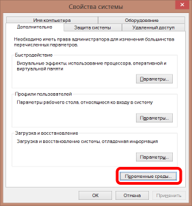
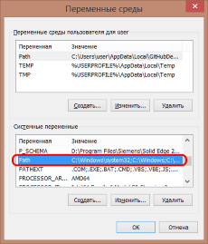
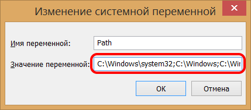
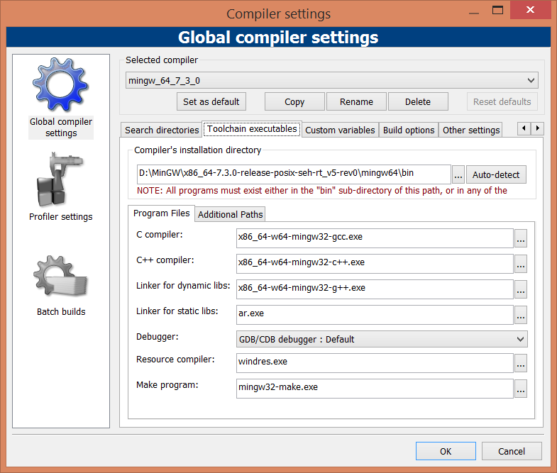

# Руководство по установке mingw

1. Скачиваем компилятор *mingw* для 32-битных систем *i686-7.3.0-release-posix-dwarf-rt_v5-rev0.7z* [здесь](https://sourceforge.net/projects/mingw-w64/files/Toolchains%20targetting%20Win32/Personal%20Builds/mingw-builds/7.3.0/threads-posix/dwarf/i686-7.3.0-release-posix-dwarf-rt_v5-rev0.7z/download) 
или для 64-разрядных систем *x86_64-7.3.0-release-posix-seh-rt_v5-rev0.7z* [здесь](https://sourceforge.net/projects/mingw-w64/files/Toolchains%20targetting%20Win64/Personal%20Builds/mingw-builds/7.3.0/threads-posix/seh/x86_64-7.3.0-release-posix-seh-rt_v5-rev0.7z/download).

2. Распаковываем в папку, куда вам удобно. Рекомендовано *C:\MinGW*
3. Не забудьте добавить путь к вашему компилятору в PATH! 

Например, вот путь до папки *bin* вашего компилятора: *D:\MinGW\x86_64-7.3.0-release-posix-seh-rt_v5-rev0\mingw64\bin*.
В *переменных среды* должна быть переменная *PATH* или *Path*.

Добавьте в эту переменную путь *D:\MinGW\x86_64-7.3.0-release-posix-seh-rt_v5-rev0\mingw64\bin*, символ *;* является разделителем.

# Добавление компилятора в Code::Blocks

Чтобы использовать установленный компилятор в *Code::Blocks*, укажите в настройках компилятора пути к нему.

Можно скопировать настройки компилятора по умолчанию и изменить его название и пути к самому компилятору.

