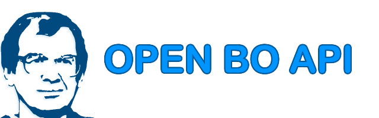

# open-bo-api


*Улыбающийся Мавроди отпугивает представителей секты свидетелей лохотрона и является талисманом данной библиотеки*

## Описание

**OpenBoApi** - это C++ *header-only* библиотека для работы с API брокеров бинарных опционов. С помощью этой библиотеки **Мы Можем Многое**:
* Открывать сделки (в перспективе - сразу на разных брокерах)
* Получать котировки из разных источников
* Фильтровать сигналы от новостей или использовать прогнозы новостей
* Да в общем все, что угодно, можно сделать на базе этой библиотеки

**Проект пока еще находится в стадии разработки! Исходники могут измениться, а работоспособность программ не гарантирована!**

## Кому это может пригодиться?

Данная библиотека может быть полезна, если вы:
* Умеете кодить на С++ и хотите сделать робота-грааль для торговли, заложив в него свою супер-стратегию
* Умеете кодить на С++ и хотите сделать робота для продажи, так как это безопаснее, чем торговать самостоятельно
* Умеете кодить на С++ и хотите сделать робота для продажи, так как ваши стратегии на самом деле не работают
* Умеете кодить на С++ и хотите сделать робота с мартингейлом для заработка по партнерской программе
* Умеете кодить на С++ и хотите сделать робота для копирования сигналов, чтобы вести ДУ
* Умеете кодить на С++ и хотите сделать робота для копирования сигналов, чтобы зарабатывать по партнерской программе с оборота средств или со слива трейдеров
* **Не умеете кодить на С++**, но собираетесь нанять фрилансера, который *умеет в Си*, чтобы сделать что-то из выше описанного на базе данной либы
* **Не умеете кодить на С++, но обращаетесь к автору библиотеки**, который подумает, стоит ли с вами вообще связываться) Если что, пишите: git.electroyar@gmail.com

## Инструкция по установке

Данный проект поддерживает *С++11* и был проверен на компиляторе *x86_64-7.3.0-release-posix-seh-rt_v5-rev0*. Проект имеет множество зависимостей, но большинство из зависимостей - *header-only* библиотеки.
Все зависимости добавлены в папку *lib* как субмодули. Разработка библиотеки производилась в IDE [Code::Blocks](http://www.codeblocks.org/). Готовые примеры проектов можно найти в папке *code_blocks*. 

### Шаг №1

Загрузите репозиторий при помощи git сразу с субмодулями (библиотеками в папке lib). Для этого в командной строке выполните команду:

```
git clone --recurse-submodules -j8 https://github.com/NewYaroslav/open-bo-api.git
```

Дождитесь завершения загрузки. Это будет не быстро.

### Шаг №2

Распакуте в папке *lib* архивы *boost_1_71_0.zip* (библиотека boost с заголовками asio) и *utf8_v2_3_4.zip* (библиотека для работы с utf8). Без этих библиотек собрать проект не выйдет.

### Шаг №3

Откройте проект code_blocks\trading_robot_template\trading_robot_template.cbp при помощи *Code::Blocks*. В проекте указан компилятор *mingw_64_7_3_0*, который в вашем *Code::Blocks* отсутствует. Вы можете добавить настройки компилятора с именем *mingw_64_7_3_0* в Settings->Compiler или поменять компилятор проекта на стандартный *GNU GCC Compiler*.
Проект точно должен работать с компилятором *x86_64-7.3.0-release-posix-seh-rt_v5-rev0*, но вы можете скачать последнюю версию [тут](https://sourceforge.net/projects/mingw-w64/files/Toolchains%20targetting%20Win64/Personal%20Builds/mingw-builds/6.1.0/threads-posix/seh/)
Почитать про устанвоку компилятора можно в инструкции **MINGW_INSTALL.md**

### Шаг №5

Внесите изменения в проект *trading_robot_template, trading_robot_template_with_mt4* или *trading_robot_template_with_mt4_2*  под ваши нужды. Библиотека *xtechnical_analysis* содержит индикаторы, корреляцию и статистические показатели. Конечно же можно использовать и другие библиотеки, такие как [ta-lib](http://www.ta-lib.org/)
Проект *trading_robot_template_with_mt4_2* использует поток котировок от MetaTrader4, остальные проекты используют поток котировок брокера.

### Шаг №6

Вы можете отблагодарить автора. Если вы хотите поддержать развитие данной библиотеки и собираетесь торговать у брокера intrade.bar, зарегистрируйтесь, пожалуйста, [по этой партнерской ссылке](https://intrade.bar/67204). Сумма, равная 1% от оборота (т.е. не важно, в плюс вы торгуете или в минус) будет идти на поддержку данного проекта. 
Еще можно просто написать мне спасибо на почтовый ящик, или наоборот, прислать письмо полное гнева, если вас что-то сильно огорчает в этой библиотеке. 

## Возможности библиотеки

* Можно работать с брокером intrade.bar (получать процент выплат, баланс депозита, открывать сделки), остальные брокеры будут постепенно добавляться в библиотеку
* Можно использовать поток котировок брокера intrade.bar
* Можно перехватывать поток котировок из MetaTrader4 (библиотека [mt-bridge](https://github.com/NewYaroslav/mt-bridge))
* Можно загружать экономические новости
* Можно использовать индикаторы, корреляцию и статистические показатели из библиотеки [xtechnical_analysis](https://github.com/NewYaroslav/xtechnical_analysis)
* Можно работать со временем при помощи библиотеки [xtime_cpp](https://github.com/NewYaroslav/xtime_cpp)

