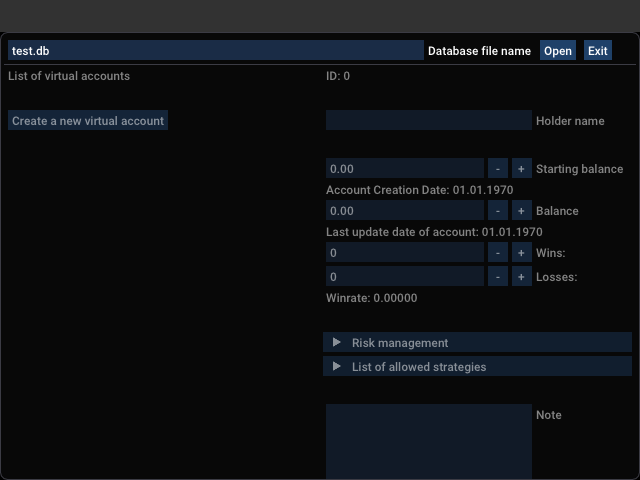
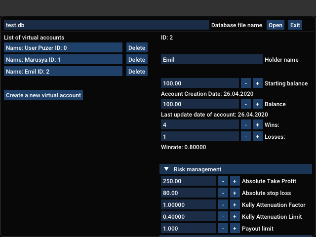

# Руководство по работе с редактором виртуальных аккаунтов

Виртуальные аккаунты - это что-то вроде "кухки" в "кухне": имя один депозит у брокера, его можно "мысленно" разделить на части. 
Каждая часть депозита будет при этом жить своей жизнью: можно совершать сделки только по определенным стратегиям, с определенным риском и так далее.

Редактор виртуальных аккаунтов позволяет предварительно создать виртуальные аккаунты, указать условия торговли и начальный баланс.
Это необходимо сделать, прежде чем использовать виртуальные аккаунты в роботе. 

